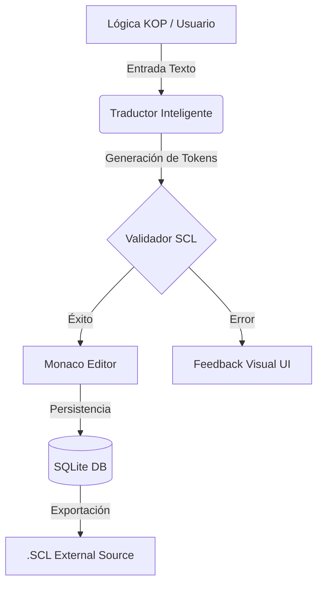

# 🌉 Siemens Logic Bridge 
### *Industrial Engineering 4.0 Presentation*

---

> **"Uniendo la automatización clásica con la ingeniería de software moderna."**

---

## 📽️ Presentación del Proyecto

### 01. El Problema y la Solución
En la industria, la transición de Ladder (KOP) a SCL puede ser lenta y propensa a errores. **Siemens Logic Bridge** actúa como un acelerador digital, permitiendo a los ingenieros concentrarse en la arquitectura mientras el sistema maneja la sintaxis.

| 🗲 Transformación Visual | 🏭 Infraestructura |
| :--- | :--- |
|  |  |
| **Traducción en tiempo real** de lógica KOP a estándar IEC 61131-3. | **Puente Digital** entre TIA Portal y desarrollo Web moderno. |

---

### 02. Capacidades de Ingeniería
El sistema no es solo un traductor, es un entorno completo de preparación de datos para PLC S7-1200 y S7-1500.

---

## 🛠️ Especificaciones Técnicas

### Stack Tecnológico
- **Frontend**: UX Premium con React y Framer Motion.
- **Backend**: Node.js + Sequelize.
- **Editor**: Kernel de VS Code (Monaco Editor).
- **Estándar**: Totalmente compatible con Siemens TIA Portal.

---

## 📦 Instalación Rápida

1. **Clonar**: `git clone https://github.com/leohidalgovelasquez-max/Proyecto_SCL-IEC61131.git`
2. **Instalar**: `npm install`
3. **Lanzar**: `npm run dev`

---

## 🌐 Demo Online
Explora la presentación interactiva del proyecto en:
👉 **[https://leohidalgovelasquez-max.github.io/Proyecto_SCL-IEC61131/](https://leohidalgovelasquez-max.github.io/Proyecto_SCL-IEC61131/)**

---

© 2026 Desarrollado por **Leo Hidalgo Velasquez**.
